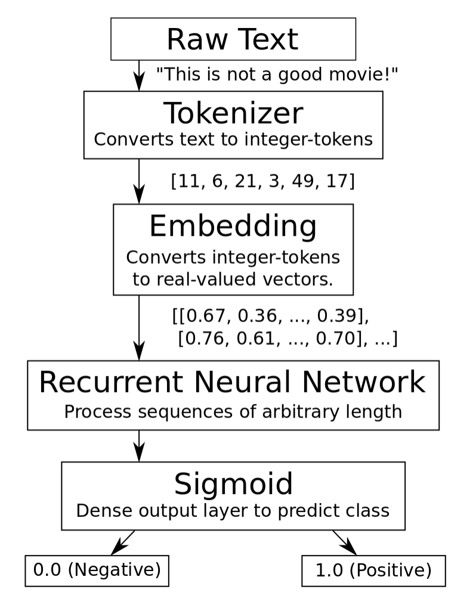
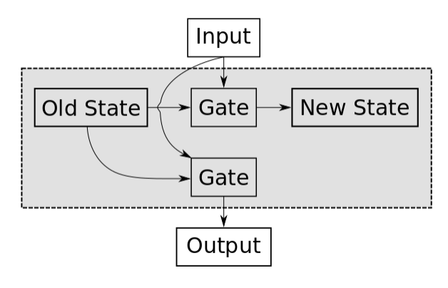
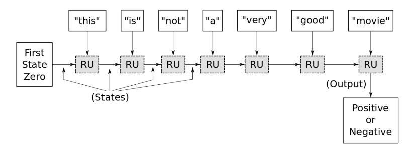
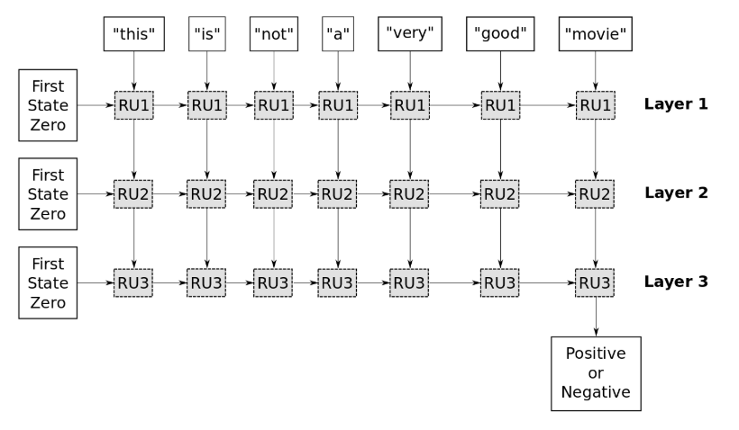

# Youtube NLP Example Notes

Reference: [YouTube](https://www.youtube.com/watch?v=DDByc9LyMV8&index=27&list=PL9Hr9sNUjfsmEu1ZniY0XpHSzl5uihcXZ)

### Flow 

Raw Text : "This is not a good movie"
- One problem is that sequences will have different lengths, this is a very short one 
- Another problem is that if you just look at indivudal words for example "good" This indicates its a positive sentiment, but it's preceded by the word not which is a negative sentiment. It gets a lot more complicated.
- A neural network cannot work on just raw text

Tokenizer : Converts text to integer tokens
- So a neural network has to covert the words into `tokens` (integer values) so we go through our entire data set, and we count the number of times each word is being used, and we make a vocabulary, and each word get an index in this vocabulary.  
- (This is not a good movie) --> (11 6 21  49 17)
- This = token id 11,   is = token id 6,   etc... 

Embedding : Converts integer tokens to real value vectors
- Each individual token is then translated to its own vector i.e. "This" is token id 11 which is then broken in ( (.67, .36, ... , .79),  (TOKEN_VECTOR_FOR_"IS"))
- The mapping between a Token and Embedding is that the `embedding vector` learns the semantic meaning of the words so that words with similar meanings are somewhat close together in this embedding space
- So to Recap, for each of the raw text, we will get out a two dimensional matrix that will become a tensor that will now go into our recurrent Neural Network

Recurrent Neural Network : Process sequences of arbitrary length 
- Outputs to Sigmoid or a polycondensed layer with a sigmoid activation function

Sigmoid : Dense output layer to predict class (0.0 Negative to 1.0 Positive)

## Recurrent Neural Network

- The basic building block of a Recurrent Neural Network is a Recurrent Unit. This flowchart above is an abstraction of what goes on by the recurrent unit
- The input is a word i.e. "good" that is converted into its embedding vectors
- The `Recurrent unit` has a memory state and depending on the content of this state and the content that we are seeing, and our input, we will update our state and write new data there. For example, if we have previously seen the word "not" in our input, we write that to our state, so that when we see the word "good", We know that we have just seen the word not, so we will write into our state we've seen "not good" together which will lean the whole input text into a negative sentiment
- The mapping of the old state, through the mapping to the new state is done through a `Gate` and how these are implemented are from different versions of Recurrent Units. (NOTE: This is the top gate in the photo) It is basically a matrix operatrion with an activation function, but there is a `problem with back propogation gradients`, so it will be decided in a different way so the gradients are not distorted too much. 
- The lower gate is a similar gate to produce the output, and the output of the recurrent unit depends on the current content of the state, and the input taht we are seeing

### Example, Unrolling the process

- What we have here is just one recurring unit. This flow chart shows what happens are different times during the unit.

Timesteps:
1. Internal memory state initalized to zero. This is reset whenever we start to analyze a new sequence of data 
2. Adding the word "This" to the recurring unit
3. This word doesn't really have too much meaning so the overall State doesn't change
4. We add the word "is" to the flow, and this still doesn't add any value, so the value can still be zero
5. We then add the word "not" and we know this adds value. we store this in the memory The gate inside the recurrent unit sees that the state near zero values, but now wants the store the word "not" and stores some non-zero state
6. "a" is basically ignored
7. "very" - stores this somehow in memory state, and this implies a strong sentiment state
8. "good" - at this point it now determines its a strong negative state
9. "movie" - is ignored - not really relevant

- We then want to train this by giving it thousands of movie ratings providing it the true sentiment rating of positive or negative.
- Tensorflow needs to figure out what the gates inside the recurrent unit should be so that they accurately map the input text to the correct sentiment

### Example Architecture

- This example has three layers. It has recurrent unit 1,2,3.
- In the first layer happens in what was just explained in unrolling the process except it is outputting the value of the recurrent unit at each timestamp
- We then gather a new sequence of data - the output from the first layer and we input that into the second recurrent layer. Recurrent layers need sequences of input data, and the output that we got from the first layer that we want to feed into the second layer are floating point values that we don't understand the meaning of. It has meaning in the neural network, but not to us as humans.
- The second layer takes the output of the first recurrent unit, inputs and processes it with the gates inside that recurrent unit. It updates the state, and then takes the output the first layer's second word "is", and use that as input, as well as the internal memory state, and continue doing this until we processed the whole sequence and then gather all the outputs of the second layer and feed that into the third layer to do a similar processing. But here we only want the output of the last timestep which will be a summary of everything that it has seen which is then passed to the sigmoid activation function to get that 0-1 value.

### Phenomenon of Exploding and Vanishing Gradients
Imagine that you had a text with 500 words. At every timestep that we apply the internal gates of a recurrent unit in a recursive manner. Meaning we will apply these gates 500 times to update the internal memory state of the recurrent unit. The way neural networks are trained are using `back propogation`  of the the `gradients` so we have some `loss function`  that gets the output of the neural network and then the true that we desire for the given input text then we want to minimize this `loss value` so that the actual value of the neural network corresponds to the actual value for this particular input text. We need to take the gradient of this loss function with respect to the `weights ` of the recurrent units, and these weights are for the gates of the internal state, and outputting the value in the end. Now the gate is applied 500 times, and this has multiplication in it. What we essentially get is an` exponential function`. If you multiply a value by itself 500 times and its value is slighly below 1, then it will very quickly go towards zero. Therefore all the information in the gradient is loss by the time we get back to the step. Similarily, if the value is slightly above 1, and multiplied by itself 500 times, by the time it gets back to the unit, it will have exploded.  The only values that can survive 500 multiplications are 0 and 1. Therefore the recurrent unit is more complicated that was explained the the diagram (in the recurrent neural network). We need to be very careful about propogating the gradients backwards through these gates so we don't have this exponential multiplication over many many time steps 

